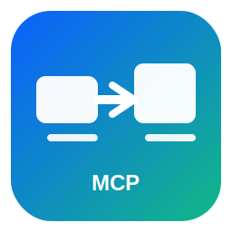

# DevBridge MCP

[简体中文](./README.md) | [English](./README.en.md)

<p align="center">
  
</p>


> 让 Claude Code / Codex 在本地编程，而在远程服务器执行与调试。

DevBridge MCP 是一个面向 AI 工程与科研场景的 MCP 服务端，通过 SSH 稳定连接**本地 AI 编程客户端**（Claude Code / Codex）与**远程 Linux 服务器**。它把“本地智能编码体验”和“远程高算力执行环境”打通成一条低摩擦开发链路。

对于需要频繁实验、调参、训练和复现实验结果的团队，DevBridge MCP 可作为一款**科研高效工具**：本地改代码、自动同步、远程执行、实时回传日志与结果。在复杂网络环境下，它也常被当作实用的**科研神器**，帮助你在不改变现有服务器网络策略的前提下持续高效迭代。

你可以把 DevBridge MCP 理解为 AI 研发工作流里的“本地-远程桥接层”：本地保留 Claude Code / Codex 的高效率开发体验，远程承接 GPU 训练、数据处理、论文实验复现等重负载任务，同时把日志、状态、结果持续回流到本地调试闭环。

**关键词 / Search Tags**: 科研工具, 科研高效工具, 科研神器, 开发工具, 开发MCP, 论文MCP, 论文复现, AI科研工作流, MCP开发工具, remote development, MCP server, Claude Code, Codex

## 1. 项目解决什么问题

在 AI/ML 开发里，常见现实是：

- 本地 macOS 开发体验最好（AI 编程工具可用）
- 算力在远程 GPU 服务器（A100/H100，长任务）
- 部分服务器在防火墙或内网环境，无法直接连国际互联网
- 这些服务器上很难直接使用 Claude Code / Codex

DevBridge MCP 的定位是一个本地网关：

1. Claude Code / Codex 在本机运行
2. DevBridge MCP 在本机运行并管理 SSH
3. 命令在远程服务器执行
4. 输出、日志、结果回流到本地 AI 上下文

这样你可以保留：

- 本地 AI 辅助编程体验
- 远程执行与调试能力
- 长任务日志追踪
- 固定化迭代流程（改代码 -> 同步 -> 执行 -> 观察 -> 下一轮）

## 2. 快速开始

### 2.1 环境要求

- 本地 macOS / Linux
- Node.js 18+
- 可用的 SSH 访问
- `git`

安装并构建：

```bash
cd remote-executor-mcp
npm install
npm run build
```

### 2.2 配置 SSH 免密登录

推荐使用密钥登录。

1. 生成密钥（如果你还没有）：

```bash
ssh-keygen -t ed25519 -C "your_email@example.com"
```

2. 查看公钥：

```bash
cat ~/.ssh/id_ed25519.pub
```

3. 写入服务器：

```bash
cat ~/.ssh/id_ed25519.pub | ssh user@your-server-ip 'mkdir -p ~/.ssh && chmod 700 ~/.ssh && cat >> ~/.ssh/authorized_keys && chmod 600 ~/.ssh/authorized_keys'
```

4. 在 `~/.ssh/config` 配置别名：

```sshconfig
Host Los_dc03
  HostName 104.168.103.56
  User root
  Port 22
  IdentityFile ~/.ssh/id_ed25519
```

5. 验证：

```bash
ssh Los_dc03
```

如果无需输入密码即可登录，说明配置完成。

### 2.3 配置 Claude Code

在 `~/.claude/settings.json` 添加：

```json
{
  "mcpServers": {
    "remote-executor": {
      "command": "node",
      "args": ["/Users/keamy/Desktop/cc-remote/remote-executor-mcp/dist/index.js"]
    }
  }
}
```

重启 Claude Code 后，验证示例：

```text
请调用 list_servers
```

```text
测试连接 Los_dc03
```

### 2.4 配置 Codex

```bash
codex mcp add remote-executor -- node /Users/keamy/Desktop/cc-remote/remote-executor-mcp/dist/index.js
```

验证：

```bash
codex mcp list
codex mcp get remote-executor
```

## 3. 工具清单（当前版本）

| 分类 | 工具 | 说明 |
|---|---|---|
| 基础执行 | `remote_execute` | 短任务同步执行（<5 分钟） |
| 后台任务 | `remote_run_background` | 使用 `nohup` 启动长任务，返回 PID 与日志路径 |
| 后台任务 | `remote_tail_log` | 拉取/跟踪日志输出 |
| 后台任务 | `remote_check_process` | 检查进程状态 |
| 后台任务 | `remote_kill_process` | 终止进程 |
| 文件同步 | `remote_sync` | 本地 -> 远程同步（`auto/rsync/scp`） |
| 文件同步 | `remote_pull` | 远程 -> 本地拉取 |
| Git | `remote_git_push` | 本地提交并推送 |
| Git | `remote_git_clone` | 从服务器克隆到本地 |
| Git | `remote_git_pull_local` | 拉取最新到本地 |
| Git | `remote_git_init` | 在服务器初始化仓库 |
| 开发会话 | `dev_session_start` | 启动监听 + 自动同步 + 执行 |
| 开发会话 | `dev_session_status` | 查看会话状态 |
| 开发会话 | `dev_session_stop` | 停止会话 |
| 工具 | `list_servers` | 列出服务器配置 |
| 工具 | `test_connection` | 测试 SSH 连通性 |

## 4. 固定化工作流示例

### 4.1 短任务循环

```text
启动 short 会话：
- server: Los_dc03
- local_path: /path/to/local/project
- remote_path: /root/project
- remote_working_dir: /root/project
- mode: short
- short_command: python3 -m pytest -q
- method: auto
- exclude: [".git", "node_modules", "__pycache__", "*.log"]
- debounce_ms: 500
```

### 4.2 长任务循环（训练）

```text
启动 long 会话：
- server: Los_dc03
- local_path: /path/to/local/project
- remote_path: /root/project
- remote_working_dir: /root/project
- mode: long
- long_command: bash -lc 'python3 train.py --epochs 10'
- method: auto
- poll_interval_seconds: 2
- log_lines: 120
- follow_seconds: 1
```

## 5. 开源与贡献

本项目已开源，欢迎社区贡献。

- 贡献指南：[`CONTRIBUTING.md`](./CONTRIBUTING.md)
- 行为准则：[`CODE_OF_CONDUCT.md`](./CODE_OF_CONDUCT.md)
- 提交 Issue：[`Issues`](../../issues)
- 提交 PR：[`Pull Requests`](../../pulls)

如果你有特殊网络环境、企业防火墙限制、或跨平台需求，欢迎直接提 Issue。

## 6. 发布文案模板

仓库内置了中英文发布模板（GitHub Release + 首发推广帖）：

- [`docs/LAUNCH_KIT_ZH_EN.md`](./docs/LAUNCH_KIT_ZH_EN.md)

## 7. 许可协议

MIT License，见 [`LICENSE`](./LICENSE)。

---

补充：若你希望完整新手版中文教程，可查看：

- [`TUTORIAL_CN.md`](./TUTORIAL_CN.md)
